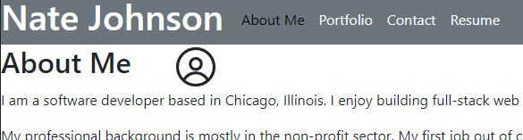

# My React Portfolio Project

## Description
This project involved the creation of a React app that would serve as my own personal portfolio of projects that I have already completed and those that will be completed in the future. I created this webpage in order to have a place to store projects that I am proud of and would like to show to others.

## Installation
No installation necessary, the portfolio is available on [Netlify](https://njohnson-react-portfolio.netlify.app/)

## Usage
The following screenshot demonstrates what the portfolio should look like in a browser:

To navigate the portfolio, use the navbar to check out the various tabs and information they include.  Under the Portfolio tab, one can find names, descriptions, and images of many apps that I have built over the past few months.  The Contact tab contains a form through which a user will eventually be able to submit messages to me.  Lastly, the Resume tab contains a list of software development proficiencies that I have attained as well as links to my technical and non-technical resumes.

## Credits
Syntax on styling react-icons: https://www.npmjs.com/package/react-icons

This portfolio also references many activities through Module 20, specifically in utilizing react-router and in using the map method to dynamically render react components.
